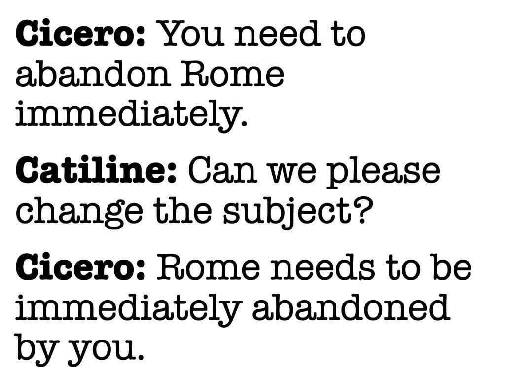

# Examen Latijn 2026–2027

Welkom op deze site! Hier vind je een overzichtelijke verzameling materialen om je goed voor te bereiden op het examen Latijn.

Je kunt direct terecht bij:
- teksten
- grammatica
- woorden
- stilistische middelen

Gebruik het menu aan de linkerkant om snel naar het onderdeel te gaan dat je nodig hebt. Of begin meteen met een tekst of een grammatica-oefening.

---

### Laatste updates
- Laatst bijgewerkt: laden...
- Deze pagina wordt regelmatig aangevuld met nieuwe uitleg, teksten en oefenmateriaal.

